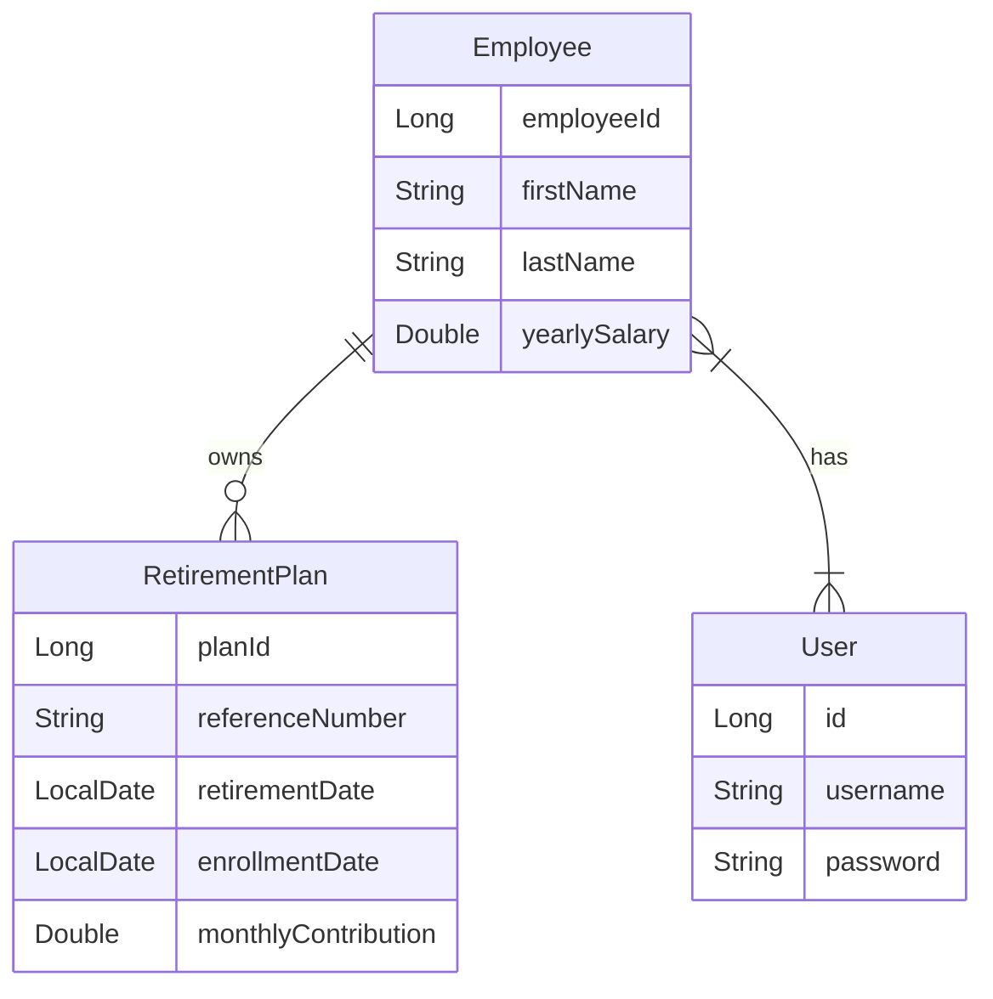

You may use this skeleton as a starting point for your solution. It contains a simple
Spring Boot web application written using Java 17 and built using Maven.

## Class Diagram

## Requirements

You need to have Java JDK 17 installed on your machine and available on your path.

## Instructions

The application is built using maven.

- To build the application, use `mvn clean install`
- Any tests that you add under the `tests` folder can be run using `mvn clean test`
- To run the application, use `gradlew bootRun`

### Table of Contents ###
### Overview ###
* Technologies Used
* Project Structure
* Setup Instructions
* Testing
* API Endpoints
* Database Configuration

This is a fully functional Java Spring Boot application is designed to manage customers, videos, video copies, and rentals. It provides RESTful API endpoints for performing CRUD operations on these entities. The application uses a modular structure with separate modules for Customer , Video, VideoCopy, and Rental, each encapsulating related functionality. For API authentication/authorization I'm using JWT with Spring Security 6, where I am integrating JWT with Spring Security 6 .

### Technologies Used ###
* Java
* Spring Boot
* Spring Data JPA / Hibernate
* MySql Workbench, and MySQL Docker image
* JUnit 5 (for unit and integration testing)
* MockMvc (for testing MVC controllers)
* JWT with Spring Security 6
* Gradle (for dependency management)
* IDE  (Intellij)
* Postman API
* Docker
* UML Diagram
### Project Structure ###
The project is organized into three modules:

* EMS: Manages employee information and their retirement plan.
* Video Module: Handles video information and operations.
* VideoCopy Module: Manages video copies and associated rentals.

### Setup Instructions ###
Prerequisites
Java Development Kit (JDK) installed
The latest version of STS (Spring Tool Suite) IDE which is built-in support for Gradle
IDE: STS (Spring Tool Suite) for development

### API Endpoints ###
### User API ###
* Post http://localhost:8080/api/v1/users/auth/add: Add new User 
* Post http://localhost:8080/api/v1/users/auth/login: To create the Token 
### Employee API ###
* GET http://localhost:8080/api/v1/employees/list: Retrieve all employees.
* GET http://localhost:8080/api/v1/employees/{employeeId}: Retrieve employee by ID.
* POST http://localhost:8080/api/v1/employees/add: Create a new employee with retirement plan.
* PUT http://localhost:8080/pi/v1/employees/{employeeId}: Update an existing employee.
* DELETE http://localhost:8080/api/v1/employees/{employeeId}: Delete an employee.

### Database Configuration ###
The application uses an MySQL database for local development. 
Database configuration properties can be found in application.yml.