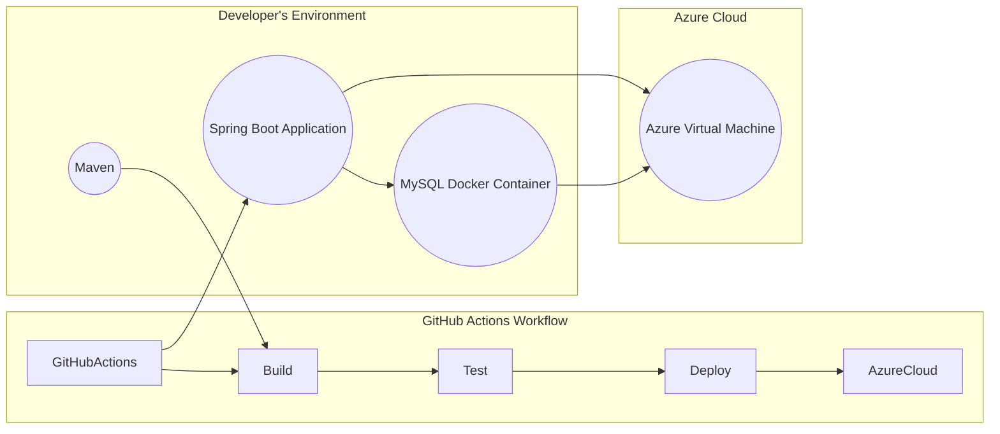
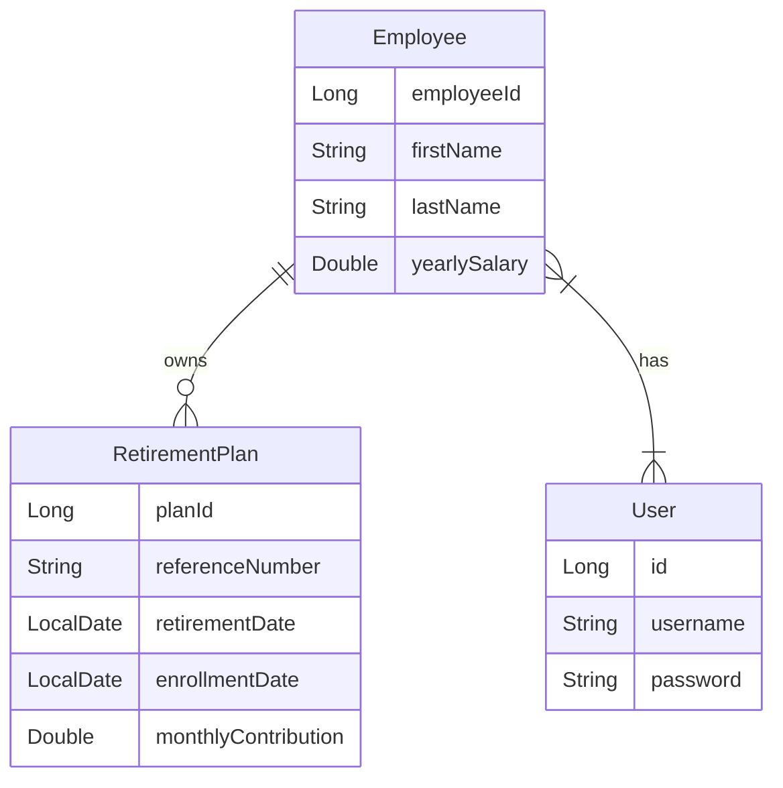

### Author: 
- Name:  Mamadou Adama Diallo
- Profile: [Mamadou Adama Diallo's LinkedIn](https://www.linkedin.com/in/amamadoudiallo/ "visit my profile")

### Problem Statement:

    The company wants a RESTFul Web API to manage data about employees and 
    their retirement plans. This API should allow enrolling new employees to their
    retirement plans, viewing, updating, and maintaining plan details. 
    Additionally, the HR managers need a feature to generate a report 
    listing employees who will retire in the next month, termed as the 
    "Monthly Upcoming Retirees" report. This report should i
    include employees whose retirement dates fall within the upcoming month.
## Functional requirements:

    - Employee Management:
        Ability to create, retrieve, update, and delete employee records.
        Validation to ensure that required fields such as first name, last name, and yearly
        salary are provided.
        Endpoints to retrieve a list of all employees, retrieve a single 
        employee by ID, update employee details, and delete an employee.
    - Retirement Plan Management:
        Functionality to enroll new employees to retirement plans.
        Endpoints to create, retrieve, update, and delete retirement plan records.
        Validation to ensure that required fields such as reference number, retirement date, 
        and enrollment date are provided.
        Endpoints to retrieve a list of all retirement plans, 
        retrieve a single plan by ID, update plan details, and delete a plan.
    - Monthly Upcoming Retirees Report:
        Feature to generate a report listing employees who will retire in the next month.
        Endpoint to retrieve a list of employees with retirement dates falling within 
        the upcoming month.
        The report should include employee details such as name, retirement date,
        and retirement plan details.
    - Security:
        Authentication and authorization mechanisms to ensure that only authorized 
        users can access the API endpoints.
        Implementation of role-based access control to restrict certain 
        functionalities to specific user roles.
    - Validation and Error Handling:
        Input validation to ensure that data submitted to the API is of the correct format and
        meets specified criteria.
        Proper error handling to provide informative error messages in case of 
        invalid requests or server-side errors.
        Use of appropriate HTTP status codes to indicate the 
        success or failure of API requests.
## Architecture Diagram:

## Class Diagram

## ER Diagram

## Requirements

You need to have Java JDK 17 installed on your machine and available on your path.

## Instructions

The application is built using maven.

- To build the application, use `mvn clean install`
- Any tests that you add under the `tests` folder can be run using `mvn clean test`
- To run the application, use ` `

### Table of Contents ###
### Overview ###
* Technologies Used
* Project Structure
* Setup Instructions
* Testing
* API Endpoints
* Database Configuration

This is a fully functional Java Spring Boot application is designed to manage employees,
and retirement plan for employee. It provides RESFull API endpoints for performing
CRUD operations on these entities. The application uses a modular structure 
with separate modules for Employee , RetirementPlan and User, 
each encapsulating related functionality. 
For API authentication/authorization I'm using JWT with Spring Security 6, 
where I am integrating JWT with Spring Security 6 .

### Technologies Used ###
* Java
* Spring Boot
* Spring Data JPA / Hibernate
* MySql Workbench, and MySQL Docker image
* JUnit 5 (for unit and integration testing)
* MockMvc (for testing MVC controllers)
* JWT with Spring Security 6
* Gradle (for dependency management)
* IDE  (Intellij)
* Postman API
* Docker
* UML Diagram
### Project Structure ###
The project is organized into three modules:

* EMS: Manages employee information and their retirement plan.

### Setup Instructions ###
Prerequisites
Java Development Kit (JDK) installed
The latest version Intellij support for Maven
IDE:  Intellij for development

### API Endpoints ###
### User API ###
* Post http://localhost:8080/api/v1/users/auth/add: Add new User

      {
         "username": "diallo",
         "password": "Diallo10@"                                       
      }

* Post http://localhost:8080/api/v1/users/auth/login: To create the Token 

         {
           "username": "diallo",
           "password": "Diallo10@"                                       
         }

### Employee API ###
* GET http://localhost:8080/api/v1/employees/list: Retrieve all employees.
* GET http://localhost:8080/api/v1/employees/{employeeId}: Retrieve employee by ID.
* POST http://localhost:8080/api/v1/employees/add: Create a new employee with retirement plan. 
  {
    "firstName": "Anna",
    "lastName": "Smith",
    "yearlySalary": 150000.00,
    "referenceNumber": "SM1009",
    "enrollmentDate": "2023-08-16",
    "retirementDate": "2026-09-29",
    "monthlyContribution": null
    }
* PUT http://localhost:8080/pi/v1/employees/{employeeId}: Update an existing employee.
* DELETE http://localhost:8080/api/v1/employees/{employeeId}: Delete an employee.

### Database Configuration ###
The application uses an MySQL database for local development. 
Database configuration properties can be found in application.yml.